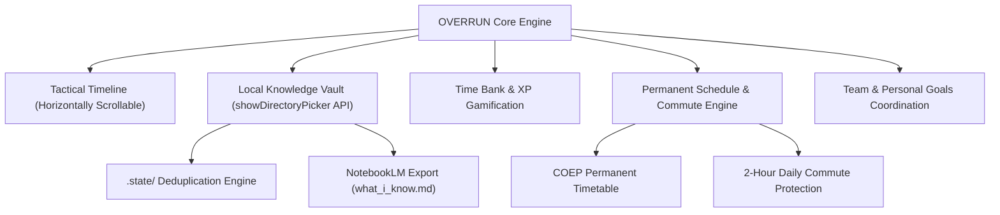

# OVERRUN — Tactical Execution & Knowledge Velocity Engine

> **High-performance timetable management, zero-token Obsidian knowledge vault integration, and aggressive deadline-driven velocity tracking.**

---


---

## Overview

**OVERRUN** is a tactical schedule engine designed for developers, students, and founders with aggressive deadlines, low tolerance for ambiguity, and multi-stream goals (e.g., DSA grind, agency scaling, portfolio projects, and college coursework).

Unlike generic calendar apps, **OVERRUN** enforces strict time-bank accountability, non-overlapping visual track allocation, zero-token local markdown/YAML vault synchronization, and browser-native local directory deduplication.

---

## Key Features



### 1. Tactical Mission Timeline
- **Spacious Horizontal Grid**: 24-hour non-overlapping timeline with 30-minute reference lines.
- **Dynamic Shimmer Pulse Waves**: Real-time Active Now green pulse and Overdue red warning pulse.
- **Interactive Action Drawer**: One-click Mark Complete, Mark Overtime, Skip, or Unmark with instant state toggles.
- **Zero Card Overlap**: Track allocation algorithm guarantees zero visual overlap across simultaneous deep-work sessions.

### 2. Zero-Token Local Knowledge Vault & .state Deduplication
- **Browser File System Access API**: Connect or scaffold your local `knowledge/` folder directly from the browser UI without uploading private notes.
- **`.state/` Deduplication**: Hidden metadata store (`vault_metadata.json`) content-hashes notes to eliminate duplicate imports.
- **NotebookLM Synergy**: One-click export to `what_i_know.md` for seamless ingestion into Google NotebookLM.

### 3. Permanent Timetable & Commute Protection
- **In-Memory Permanent Schedule**: Permanent weekly college lectures and mandatory 2-hour daily commute blocks computed on-the-fly (**0 database duplication**).
- **Mandatory Study Windows**: Enforces 1.5-hour daily college submission windows (`Type C` tasks) on all class days (Mon–Sat).

### 4. Time Bank & XP Velocity Gamification
- **Time Gain/Loss System**: Gain time-bank credit for completing tasks ahead of schedule; lose time-bank minutes for running overtime or skipping deep work.
- **Streak & XP Rewards**: Earn XP points for clean execution streaks and track daily efficiency rates.

### 5. Team vs Personal Goals Architecture
- **Personal Goals**: Stored locally on your machine (`knowledge/goals/`).
- **Team Goals**: Managed in central database schema (`Team`, `TeamMember`, `TeamGoal`, `TeamSubGoal`) for team workspace coordination.

---

## Tech Stack

- **Framework**: [Next.js 16 (App Router)](https://nextjs.org/)
- **Language**: [TypeScript](https://www.typescript.org/)
- **Styling & UI**: TailwindCSS v4, Vanilla CSS Design System, Framer Motion, Lucide Icons
- **State Management**: [Zustand](https://github.com/pmndrs/zustand) with LocalStorage Persistence
- **Database & ORM**: [Prisma](https://www.prisma.io/) with SQLite / Cloudflare D1 compatibility
- **Local I/O**: Web File System Access API (`window.showDirectoryPicker()`)
- **Hosting**: Cloudflare Pages / Vercel

---

## Quick Start

### 1. Clone the Repository
```bash
git clone https://github.com/YOUR_USERNAME/overrun.git
cd overrun
```

### 2. Install Dependencies
```bash
npm install
# or using bun
bun install
```

### 3. Environment Setup & Database Sync
```bash
npx prisma generate
npx prisma db push
```

### 4. Run Development Server
```bash
npm run dev
# App will start on http://localhost:3000
```

---

## Deployment

### Hosting on Cloudflare Pages (Recommended)

1. Push your repository to **GitHub**.
2. Open **[Cloudflare Dashboard](https://dash.cloudflare.com/)** -> **Workers & Pages**.
3. Select **Create Application** -> **Pages** -> **Connect to Git**.
4. Choose the `overrun` repository.
5. Configure Build Settings:
   - **Framework Preset**: `Next.js`
   - **Build Command**: `npm run build`
   - **Build Output Directory**: `.next`
6. Click **Save and Deploy**.

---

## Project Structure

```
overrun/
├── knowledge/                  # Local markdown knowledge vault & goal definitions
│   ├── .state/                 # Deduplication metadata & vault hashes
│   ├── goals/                  # Phase 1 - Phase 6 roadmap files
│   ├── projects/               # System documentation & feature maps
│   └── assessments/            # Subject mastery notes & quizzes
├── prisma/
│   └── schema.prisma           # Core DB schema (Tasks, Goals, Team Coordination)
├── src/
│   ├── app/                    # Next.js App Router pages & API endpoints
│   ├── components/
│   │   ├── overrun/            # Tactical Timeline, Dashboard, Knowledge & Task Cards
│   │   └── yaml-viewers/       # Multi-schema YAML renderer components
│   ├── data/                   # COEP timetable & core TypeScript definitions
│   ├── engine/                 # Task Parser, Phase 1 Seeder & Schema Registry
│   └── store/                  # Zustand persistent state management
└── README.md
```

---

## Data Safety & Privacy Guidelines

- **Local-First Architecture**: Your markdown notes, goal files, and personal study vaults stay 100% on your local machine inside your selected `knowledge/` directory.
- **Client-Side File System Access**: The browser Web File System Access API (`showDirectoryPicker()`) operates within the browser sandboxing security model. Private vault notes are never uploaded to cloud servers or third-party storage.
- **Zero Third-Party Telemetry**: OVERRUN does not collect or transmit tracking metrics, analytics tokens, or private note contents.
- **Deduplication Privacy**: The `.state/` metadata subfolder stores local content hashes strictly to prevent duplicate file imports on your own machine.

---

## Contributing

Contributions are welcome! To contribute to OVERRUN:

1. **Fork the Repository**: Click the **Fork** button at the top right of the GitHub repository.
2. **Create a Feature Branch**:
   ```bash
   git checkout -b feat/your-feature-name
   ```
3. **Make Your Changes**:
   - Ensure clean TypeScript compliance (`npx tsc --noEmit`).
   - Test builds locally (`npm run build`).
4. **Commit & Push**:
   ```bash
   git commit -m "feat: Add your feature description"
   git push origin feat/your-feature-name
   ```
5. **Open a Pull Request**: Submit a Pull Request targeting the `main` branch with a clear summary of your changes.

---

## Supporting

If OVERRUN helps you execute on aggressive goals and maintain tactical focus:

- **Star the Repository**: Click the ⭐ **Star** button at the top of the GitHub page.
- **Share Feedback**: Open an Issue on GitHub for feature requests, bug reports, or workflow improvements.
- **Spread the Word**: Share OVERRUN with fellow developers, students, and founders scaling high-velocity projects.

---

## License

Distributed under the **MIT License**. See `LICENSE` for more details.
